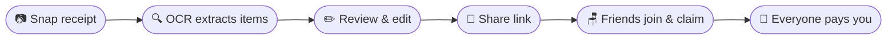
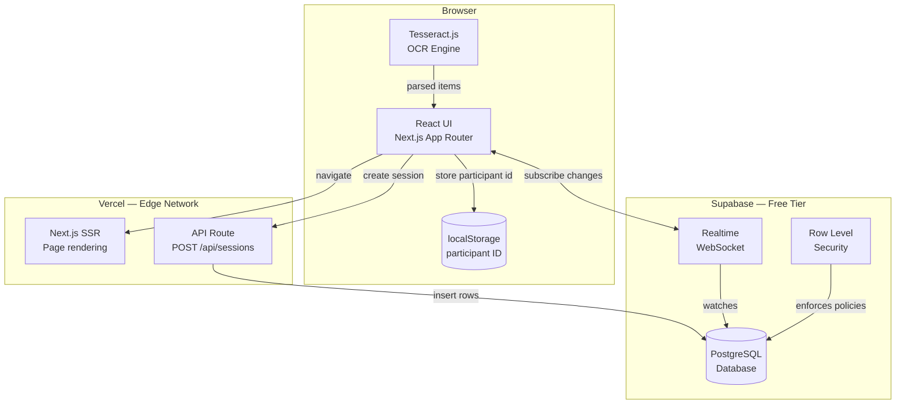
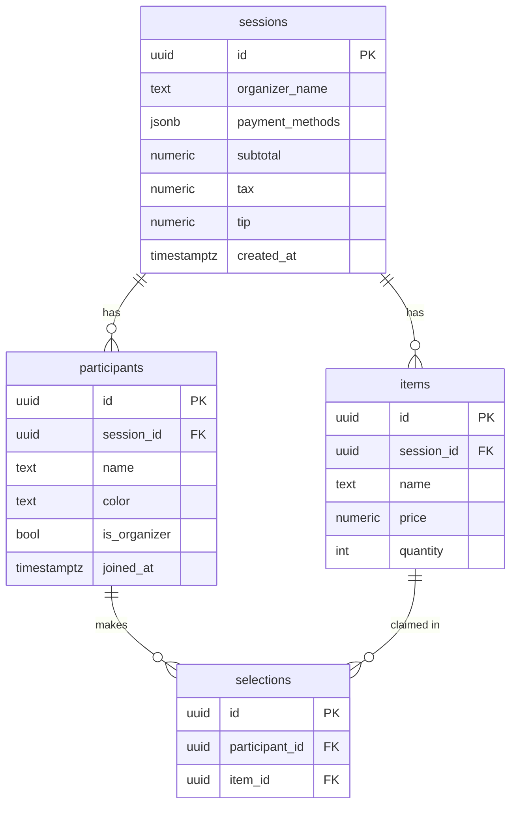
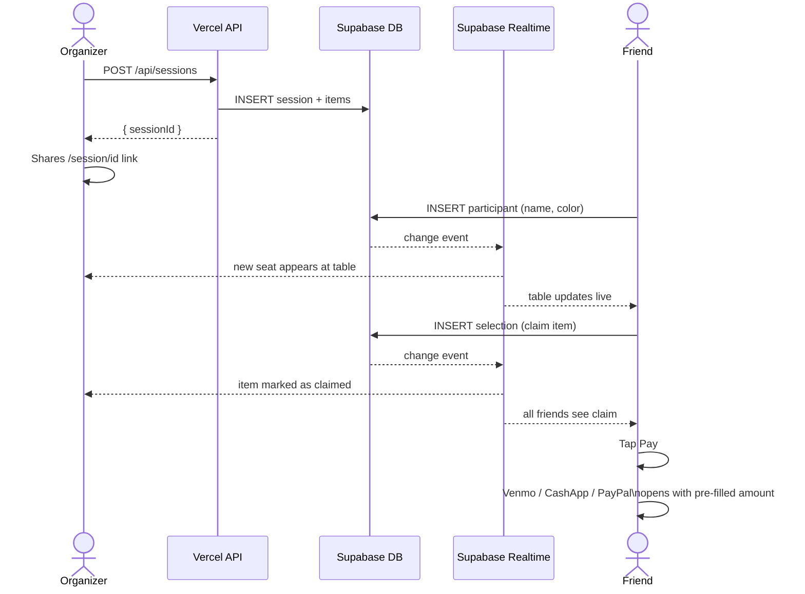
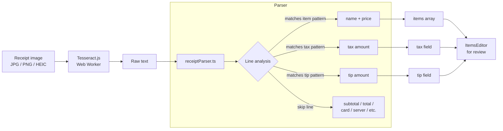

# PayMe

> Split restaurant bills without the awkward math.

Snap a receipt, share a link — everyone claims what they ordered and pays you directly in one tap. No signup required for friends. No math required for anyone.

**Stack:** Next.js 16 · TypeScript · Tailwind CSS · Tesseract.js · Supabase · Vercel

---

## Features

| | |
|---|---|
| **Free browser OCR** | Tesseract.js reads your receipt on-device. No API key, no rate limits, no data uploaded. |
| **Real-time table** | Friends join via a shared link and see each other claim items live via Supabase Realtime. |
| **Fair splits** | Multiple people can split a single item. Tax and tip divide proportionally by what you ordered. |
| **One-tap payment** | Deep links open Venmo, Cash App, or PayPal pre-filled with the exact amount owed. |

---

## How it works


## System architecture



---

## Database schema



---

## Real-time sequence



---

## Project structure

```
payme/
├── app/
│   ├── page.tsx                   # Landing page
│   ├── create/
│   │   └── page.tsx               # 4-step wizard (upload → OCR → items → payment)
│   ├── session/
│   │   └── [id]/
│   │       └── page.tsx           # Live session room with realtime
│   └── api/
│       └── sessions/
│           └── route.ts           # POST — creates session + items in Supabase
│
├── components/
│   ├── landing/
│   │   ├── Hero.tsx
│   │   └── HowItWorks.tsx
│   ├── create/
│   │   ├── UploadStep.tsx         # Drag & drop / camera capture
│   │   ├── OcrProcessor.tsx       # Tesseract.js progress UI
│   │   ├── ItemsEditor.tsx        # Editable item list + tax/tip
│   │   └── PaymentSetup.tsx       # Name + payment handles
│   ├── session/
│   │   ├── JoinModal.tsx          # Name entry overlay for new participants
│   │   ├── TableView.tsx          # SVG circular table with participant seats
│   │   ├── ItemCard.tsx           # Claimable item with split support
│   │   ├── BillSummary.tsx        # Per-person total + pay button
│   │   └── PaymentModal.tsx       # Deep links to payment apps
│   └── ui/
│       ├── Button.tsx
│       ├── Input.tsx
│       └── Spinner.tsx
│
├── lib/
│   ├── ocr.ts                     # Tesseract.js wrapper with progress callback
│   ├── receiptParser.ts           # OCR text → structured items[] with price parsing
│   ├── supabase.ts                # Supabase browser client
│   └── utils.ts                   # formatCurrency, buildPaymentUrl, participant colors
│
├── types/
│   └── index.ts                   # Session, Item, Participant, Selection, PaymentMethod
│
├── supabase/
│   └── schema.sql                 # Full DB schema — tables, indexes, RLS, Realtime
│
└── .env.local.example
```

---

## OCR pipeline



Tesseract downloads the English language model (~10 MB) on first use and caches it in the browser. Subsequent runs are instant.

---

## Payment deep links

| Method | URL format | Notes |
|--------|-----------|-------|
| Venmo | `venmo://paycharge?txn=pay&recipients=HANDLE&amount=X&note=...` | Opens Venmo app |
| Cash App | `https://cash.app/$HANDLE/X` | Opens Cash App |
| PayPal | `https://paypal.me/HANDLE/X` | Opens PayPal |
| Zelle | *(none)* | Shows handle with copy button |

---

## Setup

### 1. Supabase

1. Create a free project at [supabase.com](https://supabase.com).
2. Open **SQL Editor** and run the contents of [`supabase/schema.sql`](./supabase/schema.sql).
3. Go to **Settings → API** — copy your **Project URL** and **anon key**.

### 2. Environment variables

```bash
cp .env.local.example .env.local
```

```env
NEXT_PUBLIC_SUPABASE_URL=https://your-project.supabase.co
NEXT_PUBLIC_SUPABASE_ANON_KEY=your-anon-key
```

### 3. Run locally

```bash
npm install
npm run dev
```

Open [http://localhost:3000](http://localhost:3000).

### 4. Deploy to Vercel

1. Import this repo at [vercel.com/new](https://vercel.com/new).
2. Add `NEXT_PUBLIC_SUPABASE_URL` and `NEXT_PUBLIC_SUPABASE_ANON_KEY` under **Environment Variables**.
3. Click **Deploy**.

Every push to `main` redeploys automatically. No additional config needed — Vercel detects Next.js automatically.

---

## Local dev commands

```bash
npm run dev      # start dev server at localhost:3000
npm run build    # production build with type checking
npm run lint     # ESLint
```
